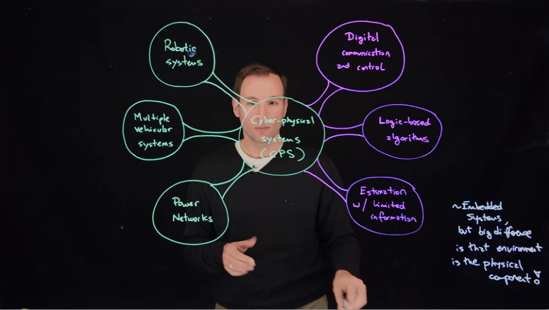

# Cyber-Pysical System

## Introdution

Cyber-Pysical System (CPS) is a system that combines, physics with cyber component **potentially networked** and **tightly interconnected**.

* **Physics**: the tangible part of the system, the plant, the process, the system
* **Cyber**: Computation components, the software , the code

The CPS, can be to involve a specific class of applications, basic tools, or methods*. That actually makes CPS a very interesting and relevant field of study.

* Class of applications Physics
    * Robotic Systems
    * Mutiple Vehicle System
    * Power Networks
* Analyze or synthesize controllers on interfaces for a CPS
    * Digital communication and control
    * Logic-based algorithms
    * Estimate with limited information

## Overview

The cyber-physical systems are similar to embedded systems, but the big difference is the enviroment

Cyber-physical systems are similar to embedded systems,
but the big difference is that the environment which is what is part of an embedded system, in CPSs, are the physics. And those physics play a key role,and they actually changed the way we need to design the cyber part. So as I said in the previous slide, typically, we cannot design the physics and the cyber separately as done in embedded systems.

    "We actually really want to make sure that the environment is handle the right way."

## Modeling Cyber-Physical Systems

