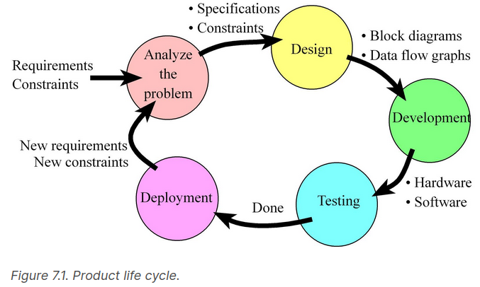

## Product Life Cycle and Requirements

**Requirements** -> **Desing** -> **Dev. (HW & SW)** -> **Test** -> **Deploy**

Project Example: SOS

* Requirements
    * Signal SOS: - - - __ __ __ - - -
    * Brigth (Green)
    * Low  power
    * Siwtch ON (SW1) and OFF (SW2)

In Analyze Requrements:

* **Safety**: The risk to humans or the environment
* **Accuracy**: The difference between the expected truth and the actual parameter
* **Precision**: The number of distinguishable measurements
* **Resolution**: The smallest change that can be reliably detected
* **Response time**: The time between a triggering event and the resulting action
* **Bandwidth**: The amount of information processed per time
* **Maintainability**: The flexibility with which the device can be modified
* **Testability**: The ease with which proper operation of the device can be verified
* **Compatibility**: The conformance of the device to existing standards
* **Mean time between failure**: The reliability of the device, the life of a product
* **Size and weight**: The physical space required by the system
* **Power**: The amount of energy it takes to operate the system
* **Nonrecurring** engineering cost (NRE cost): The one-time cost to design and test
* **Unit cost**: The cost required to manufacture one additional product
* **Time-to-prototype**: The time required to design, build, and test an example system
* **Time-to-market**: The time required to deliver the product to the customer
* **Human factors**: The degree to which our customers like/appreciate the product

Implementation

* A **top-down designer** starts with a problem, conceives of a solution, procures the parts, builds a prototype, and then tests to see if it works.
* A **bottom-up designer** first procures the parts, tries to put the pieces together in interesting ways, and then sees if it solves any interesting problems.

Easy to debug (fix mistakes)
Easy to verify (prove correctness)
Easy to maintain (add features)

* **Dynamic efficiency** is a measure of how fast the program executes.
* **Static efficiency** is the number of memory bytes required.

Qualitative performance:

* Can we prove our software works? 
* Is our software easy to understand? 
* Is our software easy to change?

**Golden Rule** of Software Development: *Write software for others as you wish they would write for you.*

* *Make the software project easier to understand
* Increase the number of modules
* Decrease the interdependency (minimize bandwidth between modules).

Things to think about but NOT implement in your lab:

There are many ways to test if two switches are pressed. For example, assume Port E is an input connected to two positive logic switches on PE3 and PE1, and we wish to execute the function FlashSOS() if switches are pressed. The first way involves an &&. The second method involves &, and the third way uses ==. Why does the first use && and the second use &? Which do you like?  Does the use of the variables make it easier to debug?

// first way
In=GPIO_PORTE_DATA_R;
S1 = In&0x08;
S2 = In&0x02;
if(S1&&S2){
  FlashSOS();
}
//********************
// second way
In=GPIO_PORTE_DATA_R;
S1 = (In&0x08)>>2;
S2 = In&0x02;
if(S1&S2){
  FlashSOS();
}
//********************
// third way
In=GPIO_PORTE_DATA_R;
if((In&0x0A)==0x0A){
  FlashSOS();
}