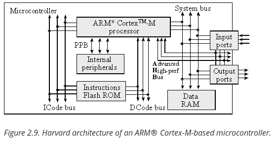
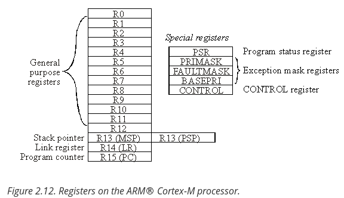

# Embedded System

 An embedded system is a microcomputer with mechanical, chemical, or electrical devices attached to it, programmed for a specific dedicated purpose, and packaged up as a complete system.

 

## Embedded Microcomputer System

* **Embedded** means hidden inside so one can’t see it. 
* **Micro** means small, and a **computer** contains a processor, memory, and a means to exchange data with the external world. 
* **System** means multiple components interfaced together for a common purpose.

**Microcontrollers**, which are microcomputers incorporating the processor, 
RAM, ROM and I/O ports into a single package, are often employed in an 
embedded system because of their low cost, small size, and low power requirements.

## Embedded System Properties

* A microcontroller hidden inside
* A dedicated purpose
* Runs in real time
* Input/output is important
* High volume, low cost
* Extremely reliable
* Low power
* Small size and weight

## Computer Organization

Software is a set of instructions, stored in memory, that are executed in a complicated but well-defined manner
processor executes the software by retrieving and interpreting these instructions one at a time.
microprocessor is a small processor, where small refers to size (i.e., it fits in your hand) and not computational ability

## ARM®Cortex™-M processor

It is a **Harvard architecture** because it has separate data and instruction buses. The Cortex-M instruction set combines the high performance typical of a
32-bit processor with high code density typical of 8-bit and 16-bit
microcontrollers.

* Instructions are **fetched** from flash **ROM** using the **ICode bus**.
* Data are exchanged with memory and **I/O** via the **system bus interface**.
* On the Cortex-M4 there is a **second I/O bus** for high-speed devices like USB.
* There are many sophisticated **debugging features** utilizing the **DCode bus**.
* Some internal peripherals, like the **NVIC** communicate directly with the
processor via the **private peripheral bus (PPB)**.

## I/O Ports

* An **input port** is hardware on the microcontroller that allows information about the external 
world to be entered into the computer.
* **output port** to send information out to the external world.
* An **interface*** is defined as the collection of the I/O port, external electronics, 
physical devices, and the software, which combine to allow the computer to communicate 
with the external world.

In general, we can classify I/O interfaces into four categories:

* **Parallel** - binary data are available simultaneously on a group of lines
* **Serial** - binary data are available one bit at a time on a single line
* **Analog** - data are encoded as an electrical voltage, current, or power
* **Time** - data are encoded as a period, frequency, pulse width, or phase shift

Ports on the TM4C123:

LaunchpPad Evoluation Kit for TM4C123:

Registers on the ARM Cortex M4

## Questions and Answer

1. What is an embedded system?

* An embedded system is a microcomputer with mechanical, chemical, or electrical 
devices attached to it, programmed for a specific dedicated purpose, and packaged up as a complete system.

2. What is a microcomputer?

* A microcomputer is a small computer that includes a processor, memory and I/O devices.

3. An input device allows information to be entered into the computer. 
List some of the input devices available on a general purpose computer.

* Typical input devices include the keys on the keyboard, mouse and its buttons, 
touch pad, DVD reader, and microphone. USB drives, Ethernet, and wireless can be used for input and output.

4. An output device allows information to exit the computer. 
List some of the output devices available on a general purpose computer.

* Typical output devices include the LEDs on the keyboard, monitor, printer, 
DVD burner, and speaker. USB drives, Ethernet, and wireless can be used for input and output.

5. What are the differences between a microcomputer, a microprocessor, and a microcontroller?

* A microprocessor is a small processor. A microcomputer is a small computer that 
includes a processor, memory and I/O devices. A microcontroller is a single chip computer.

6. Which has a higher information density on the chip in bits per mm2: static RAM or flash ROM? 
Assume all MOSFETs are approximately the same size in mm2.

* Flash ROM is higher density because it requires few transistors compared to RAM.

7. What is the addressing mode used for?

The addressing mode defines the format for the effective address for that instruction. In other words, it defines how the instruction will access the data it needs.

8. Assume R3 equals 0x2000.0000 at the time LDR R2,[R3,#8] is executed. What address will be accessed? If R3 is changed, to what value will R3 become?

0x2000.0008, R3 is not changed.

9. Assume R3 equals 0x2000.0000 at the time LDR R2,[R3],#8 is executed. What address will be accessed? If R3 is changed, to what value will R3 become?

0x2000.0000, and 8 is added to R3, it becomes 0x2000.0008.

