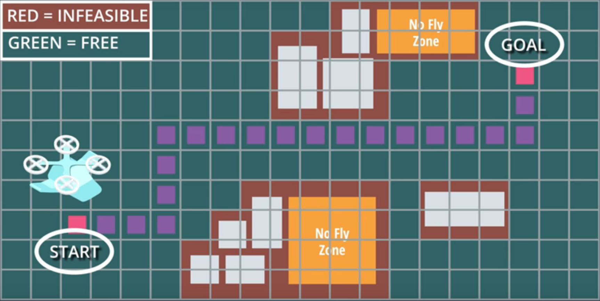

## Planning as Search

### The Planning Problem

Planning ia a core capabillity of any autonomous vehicle.

A good planner might consider possible contigencies and take vatious uncertainties into account.

### 1.4 Search space

For Search Spaces is necessary:

* All Possible States
* Start State
* Goal State
* Actions
* Costs

Questions:

1. What are the problems with using continuous curves to represent paths through free space?

* The number of possible curves is large and approaches infinity for a complex search space.
* Constraints on processing time and computational resources will limit the number of paths you can consider.
* In general, continuous curves are unnecessarily complex representations of the problem.

2. What's the solution / alternative to using continuous curves in your representation of the planning problem?

* Discretize you search space

### 1.5 Grid represenation

If I use a fine resolution is better of obstacules and freespace, but the solving the planning problem will be more
computationally expensive. If instead, I use a very coarse discretization, I reduce compuation time, but might risk 
losing too much information regarding potencial solutions.

**Is necessary to choose a grid resolution that seems to give the right balance between resolution and speed.**

Next, you will should consider the:

* Actions
* Cost functions (I'll assume the same cost for every actiom, a cost one (1))

As Dedigner I need to determine how to descretize the word, what actions are allowed, and the cost associated with each action.

Questions:

1. Which of these things do you need in order to completely represent your planning problem?

* A state space
* Actions that define how the vehicle can move from state to state
* A start state and a goal state
* Costs associated with each possible action

### 1.6 Search

A plan that does not yet reach the goal, but that contains a list of states and actions moving away from the start state.

A partial plan doesn't need to be a good plan, and doesn't reach the goal, 
but does constitute a valid list of states and actions the vehicle could take from the start state.

### 1.7 Partial Plans

Here are the rules:

    you can't move off the grid and you can't move diagonally
    you can't move through the obstacle cell in the middle
    A single plan can branch into two or more plans, where more than one option exists for expansion, but separate plans may not merge together to occupy the same grid cell.

How many partial plans do you end up with after exploring all possible paths?

* it depends

Depending on how you choose to expand each partial plan you can end up with 4 or 5 plans in total. Scroll down for an explanation and see if it agrees with your own intuition.

Q1 - What are the problems with using continuous curves to represent paths through free space (choose all that apply)?

* The number of possible curves is large and approaches infinity for a complex search space.
* Constraints on processing time and computational resources will limit the number of paths you can consider.
* In general, continuous curves are unnecessarily complex representations of the problem.

Q2 - What's the solution / alternative to using continuous curves in your representation of the planning problem?

* Discretize your search space

Q3 - Which of these things do you need in order to completely represent your planning problem (choose all that apply)?

* A state space
* Actions that define how the vehicle can move from state to state
* A start state and a goal state
* Costs associated with each possible action

Q4 - Complete the following sentence: "A partial plan is..."

* A plan that does not yet reach the goal, but that contains a list of states and actions moving away from the start state

A partial plan doesn't need to be a good plan, and doesn't reach the goal, but does constitute a valid list of states and actions the vehicle could take from the start state.

### 1.8 Breadth vs Depth

**Breadth-First Search**

* Always expands shortest plan first
* Finds the shortest path to goal first
* Can be computationaly intensive

**Depth-Firts Search**

* expands last successful action
* requires a bit of luck
* can fail completely

### 1.10 Breadth-First Search Exercise

